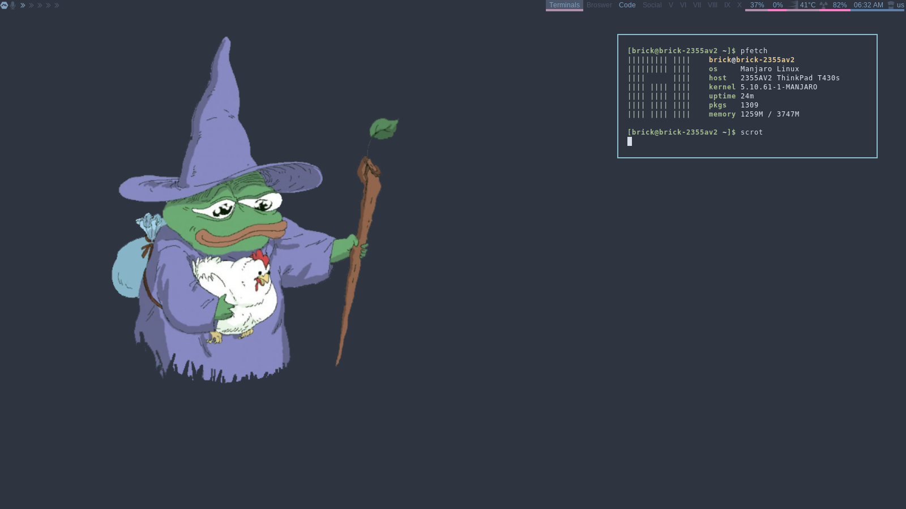
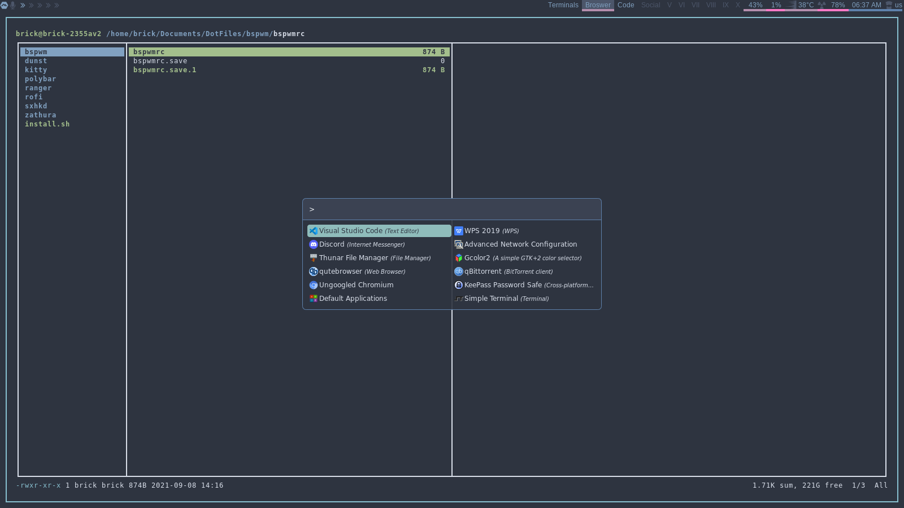

# BSPWM Nord Theme
This is a nord theme for the bspwm wm. The install script is designed for arch-based linux distros but you can still use most of the config files on any distro

## Table of contents
* [Programs](#programs)
* [Installation](#installation)
* [Screenshots](#screenshots)

## Programs 
The current programs that are included in the setup are;
* bspwm
* dunst
* kitty
* polybar
* ranger
* rofi
* sxhkd
* zathura

## Installation
To install the program clone the repo then run install.sh
```
$ git clone https://github.com/drunkenbrick/BSPWM-Nord.git
$ cd BSPWM-Nord
$ sudo chmod +x ./install.sh
$ sudo ./instal.sh
```
Alternatively you can clone it and install the config files manually

## Screenshots


